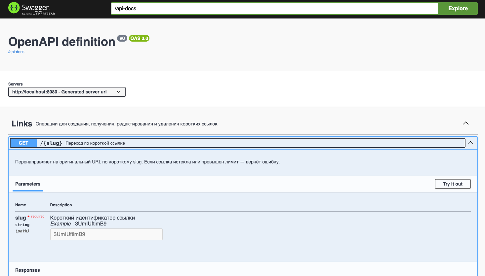

## Установка и запуск

### Требования к среде

- **Java**: 17
- **Gradle**: 8+ (рекомендуется использовать wrapper `./gradlew`)
- **Docker**: 24+

### Установка репозитория и переход в него

```bash
git clone git@github.com:StombieIT/link_shortener.git
cd link_shortener
```

### Конфигурация проекта

Для конфигурации проекта нужно создать `.env`-файл в корне проекта.
Пример его заполнения представлен ниже:
```.env
# Настройки PostgreSQL
POSTGRES_USER=postgres
POSTGRES_PASSWORD=postgres
POSTGRES_DB=link_shortener_db
POSTGRES_PORT=5436
POSTGRES_HOST=localhost

# Настройки приложения
PORT=8080                         # Порт, на котором будет запущен HTTP-сервер
URL_HOSTNAME=localhost:8080       # Хостнейм, которые будет использован для генерации ссылки
URL_SCHEME=http                   # Схема, которая будет использоваться при генерации (http/https)
LINK_TTL=86400                    # Время жизни ссылки в секундах (по умолчанию 24 часа)
SCHEDULER_LINK_DELAY_MS=86400000  # Период запуска очистки ссылок в мс (по умолчанию 24 часа)
```

### Установка зависимостей и сборка проекта

Установить все зависимости и собрать проект можно с помощью команды ниже:
```bash
./gradlew build
```

### Запуск проекта

Для запуска проекта нужно для начала запустить базу данных:
```bash
docker compose up -d
```

После чего запустить сам HTTP-сервер:
```bash
./gradlew bootRun
```

HTTP-сервер будет доступен по умолчанию на порту 8080 или на любом другом, который указан в `.env`-файле.

### help/usage

В проекте для документации поддержан `Swagger`.
Раздел с командами/контрактами/эндпоинтами будет доступен по пути `/swagger` на запущенном HTTP-сервере.



### Архитектура проекта

Основные слои

| Слой | Компоненты | Назначение                                                                                                                                                             |
|------|------------|------------------------------------------------------------------------------------------------------------------------------------------------------------------------|
| **Controller (контроллер)** | `LinkController` | Обрабатывает HTTP-запросы: создание, получение, редактирование и удаление ссылок. Отправляет ответы с соответствующими HTTP-кодами.                                    |
| **Service (сервисный слой)** | `LinkShortenerService`, `UrlService` | Содержит бизнес-логику: генерация уникальных slug, валидация URL, проверка лимитов переходов, управление сроком жизни ссылок, автоматическая очистка устаревших ссылок. |
| **Repository (репозитории)** | `LinkRepository`, `UserRepository` | Работа с базой данных через Spring Data JPA. Содержат методы для поиска ссылок по URL и пользователю, удаления старых ссылок и др.                                     |
| **Entity (сущности)** | `Link`, `User` | ORM-объекты, соответствующие таблицам в PostgreSQL.|
| **Config (конфигурация)** | `LinkConfig`, `UrlConfig` | Настройки приложения, такие как TTL ссылок (`timeToLeave`), hostname и схема (`url.host-name`, `url.scheme`) и период очистки ссылок.                                  |
| **Exception (исключения)** | `LinkDoesNotExistException`, `LinkHasExpiredException`, `UserDoesNotExistException` и др. | Исключения для обработки ошибок на уровне бизнес-логики и корректного возврата HTTP-кодов.                                                                             |
| **Model (DTO)** | `CreateLinkOptions`, `EditLinkOptions`, `CreateLinkResult` | Объекты для передачи данных между клиентом и сервисом, отделяя внутренние сущности от внешнего API.                                                                    |

Особенности архитектуры

- **Base62-хэширование**: генерация короткого slug короткой ссылки на основе URL и ID пользователя. Реализовано с нуля.
- **Срок жизни ссылок (TTL)**: настраивается через `LinkConfig` (`timeToLeave`) и проверяется при каждом GET-запросе.
- **Ограничение количества переходов**: поле `attemptsLimit` в сущности `Link`.
- **Автоматическая очистка ссылок**: `@Scheduled` метод `cleanupExpiredLinks()` в `LinkShortenerService`.
- **Идентификация пользователя**: происходит посредством HTTP-заголовка `X-User-Id`.

### Примеры команд


#### Создание короткой ссылки (POST /)

Запрос:
```bash
curl -X POST http://localhost:8080/ \
-H "Content-Type: application/json" \
-d '{
  "url": "https://example.com",
  "limit": 5
}'
```

Ответ:
```json
{
  "userId": "f19b92f3-8a3e-4c63-9b77-1e9c50450fa1",
  "shortUrl": "http://localhost:8080/3UmIUftimB9"
}
```

#### Переход по короткой ссылке (GET /{slug})

Запрос:

```bash
curl -i http://localhost:8080/3UmIUftimB9
```

Ответ:

```
HTTP/1.1 302 Found
Location: https://example.com
Content-Length: 0
```

#### Редактирование лимита ссылки (PUT /{slug})

Запрос:

```bash
curl -X PUT http://localhost:8080/3UmIUftimB9 \
-H "Content-Type: application/json" \
-H "X-User-Id: f19b92f3-8a3e-4c63-9b77-1e9c50450fa1" \
-d '{
  "limit": 10
}'
```

Ответ:

```
{
  "result": "Link '3UmIUftimB9' has been edited successfully"
}
```

#### Удаление ссылки (DELETE /{slug})

Запрос:

```bash
curl -X DELETE http://localhost:8080/3UmIUftimB9 \
-H "X-User-Id: f19b92f3-8a3e-4c63-9b77-1e9c50450fa1"
```

Ответ:

```json
{
  "result": "Link '3UmIUftimB9' has been deleted"
}
```
